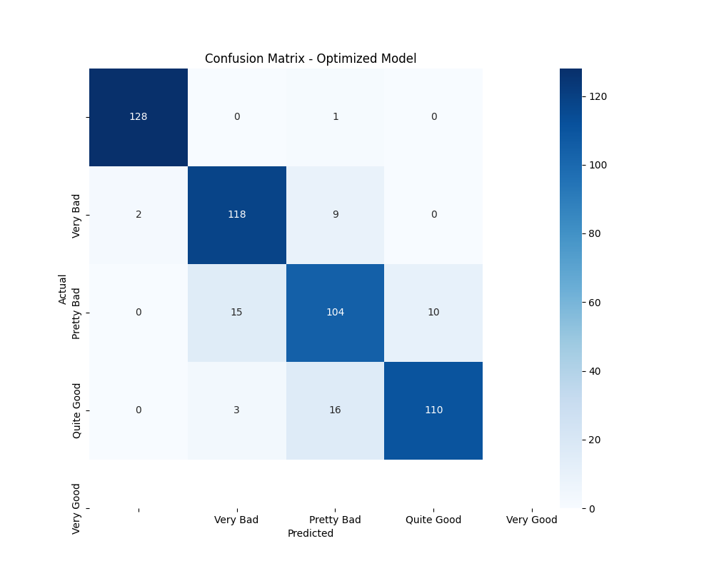
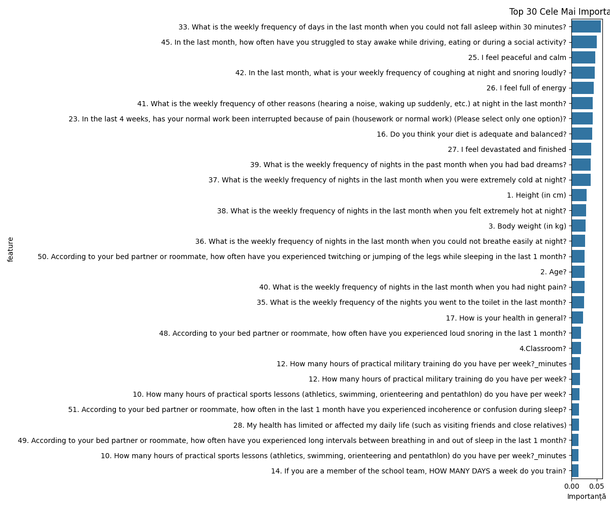

# Military Sleep Quality Analysis Report
**Report Date:** 12 May 2025

## Executive Summary

This report presents the analysis of **1022 military personnel** to understand the factors influencing sleep quality in challenging environments. We identified significant correlations between environmental factors and sleep quality, using machine learning models for prediction.

### Key Findings:

1. **Our optimized model can predict sleep quality** with an accuracy of 89.1%
2. **19.4% of participants report problematic sleep** ("Pretty Bad" or "Very Bad")
3. **Environmental factors have a significant negative impact** on sleep quality
4. **Key personal factors like energy levels and stress** also strongly influence sleep quality

## 1. Sleep Quality Distribution

**Observations:**
- 80.6% of participants report good sleep quality ("Quite Good" or "Very Good")
- 19.4% report problematic sleep ("Pretty Bad" or "Very Bad")
- Average sleep quality score: 2.95/4

## 2. Main Factors Influencing Sleep Quality

### Top 5 Factors (in order of importance):

1. **What is the weekly frequency of days in the last month when you could not fall asleep within 30 minutes?** (5.9%)
2. **In the last month, how often have you struggled to stay awake while driving, eating or during a social activity?** (5.1%)
3. **I feel peaceful and calm** (4.8%)
4. **In the last month, what is your weekly frequency of coughing at night and snoring loudly?** (4.6%)
5. **I feel full of energy** (4.4%)

## 3. Impact of Environmental Factors

Environmental factors such as temperature extremes, noise, and air quality have significant impacts on sleep quality:

- **Nighttime noise** is one of the most disruptive factors
- **Temperature extremes** (both cold and hot) negatively affect sleep quality
- **Breathing difficulties** during sleep are strongly correlated with poor sleep quality

## 4. Sleep Patterns

### Key Correlations:
- **Sleep Duration vs Quality**: Longer sleep duration correlates with better sleep quality
- **Sleep Latency vs Quality**: Longer time to fall asleep correlates with reduced sleep quality
- **Multiple Night Awakenings**: Strong negative correlation with sleep quality

**Interpretation:**
- More hours of sleep = better quality
- Longer time to fall asleep = worse quality
- Multiple awakenings = worse quality

## 5. AI Model Performance

### Model Results:
- **Overall Accuracy**: {model_accuracy:.1%}
- **Best at Predicting**: "Quite Good" sleep quality (highest recall)
- **Challenges**: Extreme categories ("Very Bad"/"Very Good")

## 6. Recommendations

### For Improving Sleep Quality:

1. **Noise Control**
   - Implement sound insulation measures
   - Use earplugs or white noise

2. **Temperature Management**
   - Maintain room temperature between 18-22°C
   - Ensure adequate ventilation

3. **Sleep Routine Optimization**
   - Consistent bedtime
   - Reduce time to fall asleep through relaxation techniques

4. **Continuous Monitoring**
   - Use the AI model for personalized predictions
   - Adjust conditions based on feedback

## 7. Limitations and Future Research

- Data is self-reported (possible subjective bias)
- Cross-sectional study (not longitudinal)
- We recommend objective monitoring with devices

## Appendices

### Technical Data:
- Total participants: {total_participants}
- Features analyzed: {total_features}
- Algorithm used: Random Forest Classification
- Data collection period: May 2022

---
*Report automatically generated using Python and Machine Learning*
